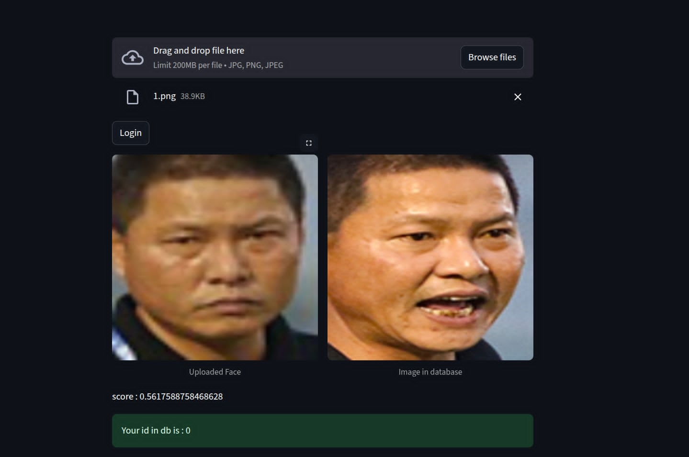

# 📌[PYTORCH] Vietnamese Face Recognition System
## 📖 Introduction

This project implements a Face Recognition System using PyTorch, specifically trained on a dataset of Vietnamese faces. While general face recognition models are often trained on large, diverse datasets, they may not always perform well on specific demographics. To address this issue,we will train new model from scrath with Vietnamese facial data to improve recognition accuracy in real-world local scenarios.

The main objectives of this project are:

+ To develop a reliable face recognition pipeline tailored for Vietnamese users.

+ To fine-tune existing deep learning models in PyTorch for better performance on region-specific datasets.

+ To enable practical applications such as identity verification, smart security systems, and personalized authentication.

## 📊 Dataset
The collected dataset consists of 23,105 face images from 1,020 individuals featured on Vietnamese Wikipedia.

📂 **Download**: [Kaggle](https://www.kaggle.com/datasets/hariwu1995/vn-celeb)  


### If you want to train with my source, you need to custom dataset format like:
### Folder descriptions
    project-root/
        ├── custom_dataset/
            ├── gallery/
            │     ├──{Id}_{No}.png
            │     ├──0_0.png
            │     ├──0_1.png
            ├── train/
            │     ├──{Id}_{No}.png
            │     ├──0_2.png
            │     ├──0_20.png
            ├── query/
                  ├──{Id}_{No}.png
                  ├──0_22.png
                  ├──0_24.png


## ⚙️ How to train my projects (GPU is required)
### Requirements
+ Python>=3.9
+ Cuda >=11.8
### 1 Clone and install libraries
``` bash
git clone https://github.com/PhamDuy204/Face-Recognition.git

pip install -r requirements.txt
```
### 2 Install and setup dataset format
* Linux

```bash
python3 ./utils/custom_dataset.py
```
* Window

``` shell
python ./utils/custom_dataset.py
```

### 3 Train Model
* Linux

```bash
python3 train.py --path 'path/to/custom_datset' --num_class 'number of different faces' --model_name 'ghost or mobile_fiaccenet' --img_size 'size of image' -emb_dim 'hidden embedding dim of model'
```
* Window

``` shell
python train.py --path 'path/to/custom_datset' --num_class 'number of different faces' --model_name 'ghost or mobile_fiaccenet' --img_size 'size of image' -emb_dim 'hidden embedding dim of model'
```

## 🧾 Demo
```bash
streamlit run demo.py -- --model_name 'ghost or mobile_facenet' --ckpt_model 'path/to/checkpoints' --cleardb 'True or False (to clear temporary database)' --emb_dim 'hidden embedding dim of model'
```
### UI
### 🧾 Register

| Register | Register with Image |
|:--:|:--:|
|  |  |

---

### 🔐 Login

| Login UI | True Image | False Image |
|:--:|:--:|:--:|
|  |  |  |


## 🖼️ Visualize Training Results

| Trained | Default |
|:--------:|:--------:|
|  |  |


